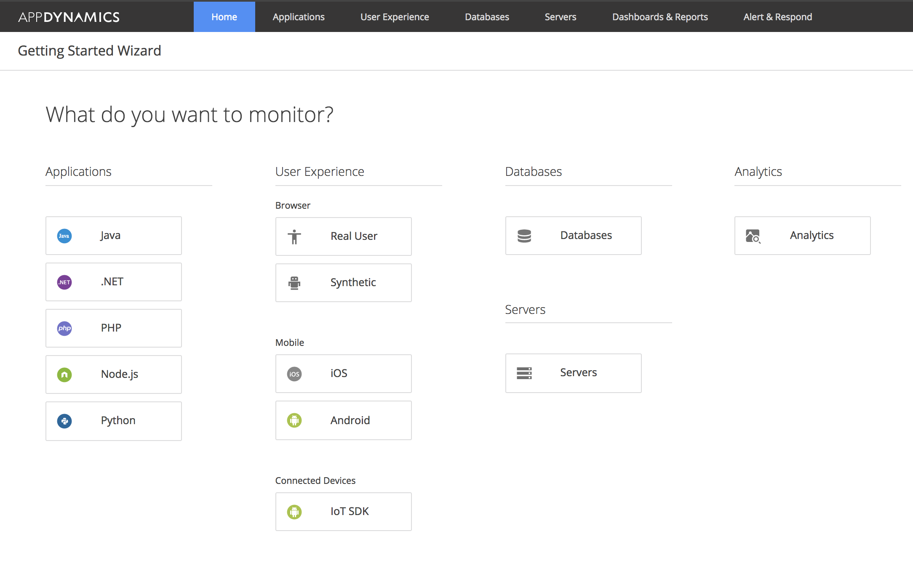
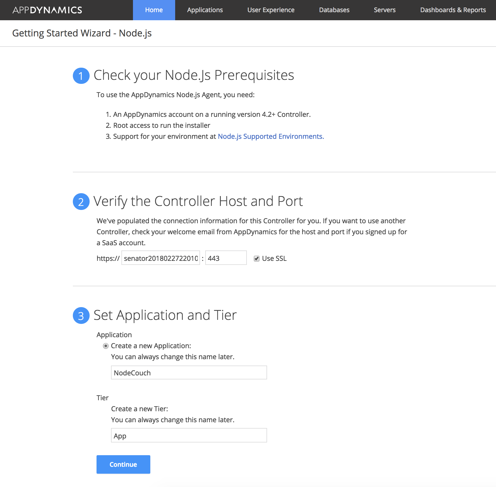
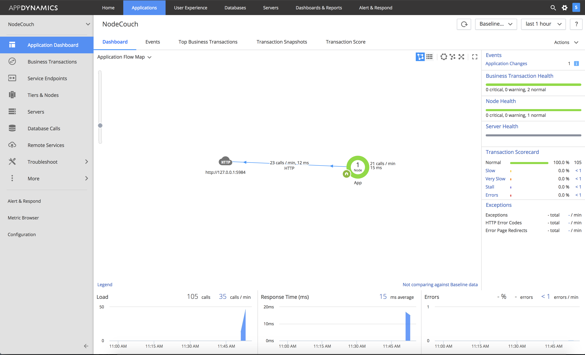
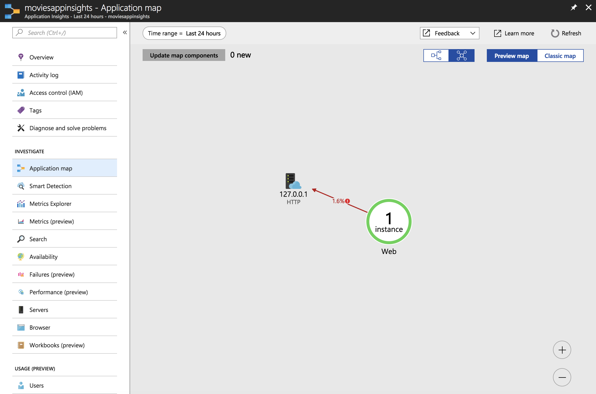

# Movie API with CouchDB backend (with Azure Application Insights and AppDynamics monitoring)

## Prerequisites 
You can run this application through Docker, but you need to have some prerequisites in place.

- Create an [Azure Application Insights](https://docs.microsoft.com/en-us/azure/application-insights/app-insights-nodejs) resource and retrieve the instrumentation key.
- Create an AppDynamics SaaS profile with node.js and retrieve controller host, account name, account access key, application name and tier name.

- Have CouchDB accessible in your environment.

## Configuration
You need to pass the following environment variables:

- `COUCHDB_URL`. Example: `http://127.0.0.1:5984`
- `COUCHDB_NAME`. Example: `movies`
- `APPINSIGHTS_INSTRUMENTATIONKEY`
- `APPDYNAMICS_CONTROLLERHOST`. Example `XXXX.saas.appdynamics.com`
- `APPDYNAMICS_ACCOUNTNAME`. Example `XXXX`
- `APPDYNAMICS_ACCOUNTACCESSKEY`
- `APPDYNAMICS_APPLICATIONNAME`
- `APPDYNAMICS_TIERNAME`

## Testing
Once you have the application running, you should be able to use Swagger-UI deployed at http://host/swagger to make a few calls.
## Monitoring

You should see the calls show up in the App Dynamics dashboard

You should also see the calls show up in Azure Application Insights

